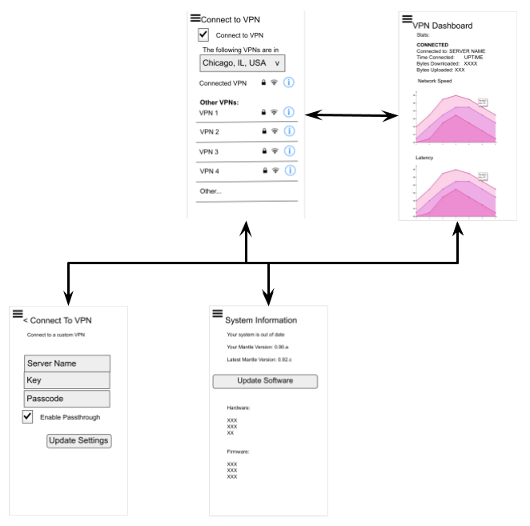

# PKT Cash VPN Utility Project

*   Project Name: pkt_utility (Project)
*   Proposal by: Anode, LLC
*   Contact Email: [jesse@anode.co](mailto:jesse@anode.co) 
*   Project participants:
    *   Adonis Gaitatzis
    *   Jeff
    *   Josh Berger
    *   Jesse Berger
    *   Jon Owens
    *   _Other participants will be added as needed_
*   Projected duration: 12 months
*   Projected effort: 16 person-months
*   Requested PKT contribution: PKT 30,000,000
*   Project status: ACCEPTED

## Project summary

PKT is a novel blockchain with immense potential. Its incentivization for providing bandwidth to the network will help PKT Cash become a public commodity. But in order for this coin to not be another speculative coin it needs to have a utility. And not just any utility, but one that helps its mission be realized. 

The project I propose is to create the first VPN application that uses PKT Cash as its fuel. This VPN will allow users to get base-line VPN for free and only pay for speed using microtransactions with PKT Cash. 

This project will be iterative as we leverage open-source technology to create a dynamic application. This first proposal of this application will be to create the VPN functionality that leverages the cjdns exit nodes for VPN access points. We will develop this application for Android to start with the intent to expand to IOS and desktop in additional proposals to come. 

Additionally, a website will be created for this new VPN, aimed at both operators and consumers. The website will educate users about the utility and use cases of the VPN, encourage downloads, and provide machine-to-machine services for both the VPN server and the Android app.

Looking into the future, our goal will be to incorporate Gridfinity, OpenVPN, Yggdrasil, and others as exit nodes in this VPN application. But those will come in subsequent proposals. Also the pay-for-speed functionality will be developed in our next proposal to the Network Stewards.

## Who we are and why us?

Our team consists of VPN and security experts who specialize in network routing, VPN, core internet infrastructure, and open-source technology. Our team has vast experience with everything from cjdns to running TOR exit nodes. We understand the ecosystem and know how to bring the value needed to make it a success. 

## Release Schedule and Budget

The VPN project will be created and deployed in stages. Each stage will be implemented in an order that most benefits the creation of a loyal community of users whose needs mature alongside the release of new features.

The project will consist of a VPN server, a client Android app, and a website for both the server and client, each targeted at is users.

The VPN server and its website will be designed for VPN operators who want to create a VPN server that routes traffic on the cjdns network. The server will allow inbound connections, will give a virtual IP address, and route traffic. Its website will encourage downloads and adoption, and will provide documentation and education about the VPN and cjdns.

The client app and its website will be designed for VPN consumers who want to connect to VPNs from their phone. The app will list and suggest VPN servers that support cjdns and will allow users to select and connect to these VPN servers. Its website will encourage downloads and adoption, and will provide documentation and education about the app and cjdns.

### Server

The version 1 VPN server will be a Docker container that runs a cjdns-powered VPN server. This VPN server will be used to encrypt and route traffic for consumers of the VPN service. It will compete with existing VPN services, so as to create utility for PKT using an known business case with existing user demand. 

 

The VPN server app can be deployed on Linux, so it can provide service from home and office users in rural areas as from server farms near urban areas. For adoption, a client app and a back-end server are both required

The VPN will attempt to auto-configure for the fastest VPN, thereby providing the best possible network speed to the user. The user can configure their own network settings if they so desire. A social-invite tool will be integrated to allow users to share pre-configured client software with friends, family, colleagues, or clients.

The VPN software will be deployed alongside a back-end server and an informational website that educates operators about the utility and use cases, and encourages them to download and install the VPN.

The Back-End Server will need to host REST or graphql APIs for use with an Informational Website and client App, providing:


*   VPN and other server lists
*   Send notifications to users
*   Account management
*   Other features

A draft specification of the REST API can be found in [Appendix 1: API Proposal](https://docs.google.com/document/d/1-QEdFw-z0rwtemDsOhp0X_o_A3BIq_SM4bsqn5wa4yE/edit#heading=h.vein41r07pcn).

The time estimate for the Back-End server is as follows:


|Total|Est. Hours|Est. Cost|Est. PKT|
|--- |--- |--- |--- |
|Development Time|211|$25,320|843,990|


A full feature/cost breakdown is listed in [Table 1: Server Development Cost Estimate](#heading=h.d07x5bgfcgye).

The Informational Website will need to:


*   Educate consumers and encourage adoption
*   Describe the utility of the VPN App and link to a download location
*   Allow users to manage their account
*   List VPN servers including their bandwidth usage and cost
*   Send transactional emails to users

The time estimate for the Informational Website server is as follows:

|Total|Est. Hours|Est. Cost|Est. PKT|
|--- |--- |--- |--- |
|Development Time|1007|$120,844|4,028,133|


A full feature/cost breakdown is listed in [Table 2: Server Website Development Cost Estimate](#heading=h.1x40ff2reqqd).

Additionally, a project manager will be required to manage the development of these features. Assuming the Android, Website, and Server are developed concurrently at a rate of $120/hour, the project management estimates are as follows:

|Total|Est. Hours|Est. Cost|Est. PKT|
|--- |--- |--- |--- |
|Development Time|1007|$120,844|4,028,133|


### Client

The client app version 1 will be a user-friendly, auto-configuring VPN client uses cjdns protocol to route traffic and PKT to value bandwidth. It will compete with existing VPN clients, so as to create utility for PKT using an known business case with existing user demand.  

The VPN app will be deployed on Android. The React Native user interface framework will be used to create a single UI framework that allows for future scaling of the VPN client onto other platforms such as iOS. For adoption, a front-end UI and a back-end server (also proposed) are both required.

A social-invite tool will be integrated to allow users to share pre-configured client software with friends, family, colleagues, or clients.

A client-side Android app is a top priority because:

*   Apps have enhanced visibility and sharing via the on-platform app marketplace.
*   Android users tend to install more apps, especially free and experimental apps
*   Android users tend to be more technology-focused

The client Android App will need to to:


*   Send/Receive data to Server API
*   Receive alerts
*   Integrate cjdns, into Android network stack
*   Enable users to create and manage their accounts
*   Configure their VPN settings

Wireframe mock-ups for the Android App can be found in  [Figure 1: Client App Wireframes](#heading=h.dwmlo5m2luqq).

The time estimate for the client Android App is as follows:

|Total|Est. Hours|Est. Cost|Est. PKT|
|--- |--- |--- |--- |
|Development Time|1,793|$215,217|7,173,913|


A full feature/cost breakdown is listed in [Table 3: Android App Development Cost Estimate](#heading=h.s01qk5c2x8eh). 

The VPN software will be deployed alongside an informational website that educates potential users about the utility and use cases, and encourages them to download and install the App and manage their account.

The Informational Website will need to:

*   Educate users and encourage adoption
*   Describe the utility of the VPN App and link to a download location
*   Allow users to manage their account
*   List VPN servers including their bandwidth usage
*   Send transactional emails to users

The time estimate for the Informational Website server is as follows:

|Total|Est. Hours|Est. Cost|Est. PKT|
|--- |--- |--- |--- |
|Development Time|738|$88,619|2,953,964|

A full feature/cost breakdown is listed in [Table 4: Client Website Development Cost Estimate](#heading=h.iepkrs1guano).

Additionally, a project manager will be required to manage the development of these features. Assuming the Android, Website, and Server are developed concurrently at a rate of $120/hour, the project management estimates are as follows:

|Total|Est. Hours|Est. Cost|Est PKT|
|--- |--- |--- |--- |
|Website Development Time|738|$88,619|2,953,964|
|App Development Time|1,793|$215,217|7,173,913|
|Project Management Time|2,532|$303,836|10,127,877|
|Total|5,064|$607,673|20,255,754|

### Total Project

Altogether, These two projects come together to make a VPN ecosystem of independent VPN operators and a global community of VPN clients, all using the PKT network to secure and route their traffic. 

The creation of this ecosystem enables future development which can incentivize the use of PKT Cash to buy and sell bandwidth on that VPN network, thereby creating utility and value for PKT cash.

The total cost for this project is as follows:

|Total|Est. Hours|Est. Cost|Est PKT|
|--- |--- |--- |--- |
|Server Software and Website|2,436|$292,327|9,744,245|
|Android App and Website|5,064|$607,673|20,255,754|
|Total|7,500|900,000|30,000,000|

# Project Deliverables

The key deliverable will be a VPN server and Android client app, as well as a website for each.

These deliverables are:

*   New open source software
*   Which will be available under the [MIT](https://spdx.org/licenses/MIT.html) license
*   The maintainer of this software will be: Adonis Gaitatzis
*   The software will be hosted in [https://github.com/anode-co](https://github.com/anode-co)

# Payments

All payments shall be made to `pkt1q9w78py6w9dprzajquw3ngenr826gsveu4c5x50`

# Milestones

The following are milestones for the progress of the project by which the network steward can evaluate the success of the project.

The goal of these milestones is to work towards building features that unlock future work throughout the project. Features such as database management and the network connectivity enable the next features such as the ability to create and manage user accounts from a central server, which in turn enable login-based features such as per-user bandwidth tracking.

As the VPN server and Android app work together, developing and testing features side-by-side is critical for developing a successful product.

## M0: Kickoff

At the kickoff of the project, the network steward will grant PKT 10,000,000 (1/3 of the project budget) to the applicant and the project will begin.

*   Hiring and Project Planning


## M1: Specifications

Milestone 1 will focus on sketching out how the various parts will look and function together. This will include wireframes, initial designs and mock-ups, and an initial API specifications and documentation.

Upon the completion of Milestone 1, a report will be written and the applicant will seek approval from the network steward. The network steward will pay PKT 5,000,000 (⅙ of the project budget) for the completion of this milestone.

**Progress:**

At this stage there will be:

*   Design specifications, clickable mock-ups, and preliminary documentation but no functioning code.


### Server/API

API Spec


### Server Website

Design


### Client App

Wireframes


### Client Website

Design


### M2: I/O, Transactions, and Account Management

Milestone 2 will focus on the development of the core features that enable the systems to talk to one another, as well as enable users to create and manage their account and receive notifications about changes to the status of their account. This will include reading from the Android system such as network connectivity, as well as being able to send and receive Resources via a REST or graphql API.

Upon completion of Milestone 2, a report will be written and the applicant will seek approval from the network steward. Upon approval, payment of PKT 5,000,000 (⅙ of the project budget) will be issued.

**Progress:**

At this stage there will be:

*   An app and VPN server that each allow users to register and perform account management features such as changing and resetting password. 
*   However the app will not yet route traffic or enable users to connect to a VPN.


### Server/API

The server will be able to send transactional emails

A VPN operator will be able to configure their VPN server settings


### Server Website

A user will be able to log into their account

The server will be able to send transactional emails

The server will be able to read and write to an Internet Database 


### Client App

The app will be able to send and receive data via a REST API

The app will be able to store data locally in an in-device database

The app will be able to receive push alerts

The user will be able to log in via a PIN


### Client Website

The user will be able to log in to their account

The website will be able to send transactional emails


### M3: Network Integrations

Milestone 3 will focus on getting the VPN to do it’s core job of receiving connections and acting as a bridge between the traditional Internet and the PKT network. These features will include bandwidth and load monitoring as well as registering with the VPN list so that users can discover and connect to VPNs through the app.

Upon completion of Milestone 3, a report will be written and the applicant will seek approval from the network steward. Upon approval, payment of PKT 5,000,000 (⅙ of the project budget) will be issued.

**Progress:**

At this stage:

*   The app will allow users to log in and manage their accounts, connect to a PKT VPN and route traffic through that VPN. 
*   App users will be able to browse a list of VPNs and see the bandwidth and load of each VPN. 
*   VPN server administrators will have a VPN server that accepts client connections and routes VPN traffic through the PKT network, register as a public PKT VPN, and perform account management functions.  
*   Android apps users will not yet be able to auto-configure their VPN.


### Server/API

The VPN will be able to connect to, send and receive traffic through the cjdns network.

The VPN operator will be able to register their VPN on the website

The VPN will report its usage statistics to the website

The VPN will report its version to the website


### Server Website

Users will be able to browse VPNs and their statistics via an API


### Client App

The user will be able to connect to a VPN and route traffic through the cjdns network

The user will able to input VPN configurations manually

The user will be able to view statistics about their VPN usage

The user will be able to browse VPNs from a list

The user will be able to select and connect to VPNs from the list


### M4: Polish and Debug

Milestone 4 will focus on turning features into a product. Existing features will undergo integration testing and usability testing and final features will be put into place that enable users to be welcomed into the app and have the hard decisions made for them when they so desire.

Upon completion of Milestone 4, a report will be written and the applicant will seek approval from the network steward. Upon approval, payment of PKT 5,000,000 (⅙ of the project budget) will be issued.

At this point the project will reach the end of it's explicit funding, however the applicant commits to the long term maintenance of the VPN software and the network steward commits to continuing interest in the evolution of the software.

**Progress:**

At this stage:

*   VPN operators will have a reliable VPN server that performs all the functions listed in the previous milestone. 
*   Android app users will also have a stable app with no major memory leaks that performs all the functions from the previous milestone, plus enables the user to auto-configure a VPN based on their location or other preferences.

In short, the server and app will be done.

### Server/API

The user will be able to install and configure a VPN following documentation


### Server Website

The user will be able to browse the site easily and find documentation and download links


### Client App

The user will be able to select the best VPN based on location, speed, or some other criteria

The user will be presented with a welcome screen upon first run

The user will be able to share the app with friends via a social sharing tool

The user will be able to find the app on the Android Play store or on the website

The user will be able to use the app without major memory leaks or common bugs

### Client Website

The user will be able to browse the site easily and find documentation and download links


## Legal

The applicant understands that the Network Steward is not a legal entity and no part of this project constitutes any form of legal agreement. The applicant accepts that the Network Steward exists thanks to the efforts of volunteers and the applicant has no reasonable expectation of any action, payment or communication from the Network Steward at any time. For their part, the applicant has no binding commitment or obligation at any time as a result of their participation in this project.


# Table 1: Server Development Cost Estimate

|Feature|Task|Est. hours|Est. cost|Est. PKT|
|--- |--- |--- |--- |--- |
|API|VPN server list|96|$11,509|383,632|
|API|VPN version info|58|$6,905|230,179|
|API|Email users|38|$4,604|153,453|
|API|Database functionality|19|$2,302|76,726|
|Total||211|$25,320|843,990|

Costs based on an estimated $120/hour engineering and designing cost and PKT = ⅓ US Penny.

# Table 2: Server Website Development Cost Estimate

|Feature|Task|Est. hours|Est. cost|Est. PKT|
|--- |--- |--- |--- |--- |
|Website|Design informational website (roughly 10 pages)|48|$5,754|191,816|
|Website|Informational home-page|192|$23,018|767,263|
|Website|VPN/cjdns information|96|$11,509|383,632|
|Website|VPN server information (countries, line quality, etc)|96|$11,509|383,632|
|Website|cjdns server information (line quality, etc)|96|$11,509|383,632|
|Website|account management|192|$23,018|767,263|
|Website|bandwidth usage and estimates|192|$23,018|767,263|
|Website|scheduled actions such as emails to users|96|$11,509|383,632|
|Total||1007|$120,844|4,028,133|

Costs based on an estimated $120/hour engineering and designing cost and PKT = ⅓ US Penny.

# Table 3: Android App Development Cost Estimate

|Feature|Task|Est. hours|Est. cost|Est. PKT|
|--- |--- |--- |--- |--- |
|Login workflow|Design Login/logout/forgot password workflow|38|$4,604|153,453|
|New account|Design account creation workflow|19|$2,302|76,726|
|Account management|Design account management workflow|19|$2,302|76,726|
|Connection types|Design connection types workflow|19|$2,302|76,726|
|Network Auto-configure workflows|Design auto-configure VPN workflows|96|$11,509|383,632|
|Network Select from list workflows|Design select from list VPN workflows|58|$6,905|230,179|
|Custom network workflows|Design custom VPN configuration workflows|38|$4,604|153,453|
|Welcome screens|Design Dashboard/welcome screens|96|$11,509|383,632|
|Core features|Send data to/from REST API|10|$1,151|38,363|
|Core features|Implement data models and conversion to serialized formats|19|$2,302|76,726|
|Core features|Email / Text information to user (Twilio integration)|38|$4,604|153,453|
|Core features|Location finding from IP|10|$1,151|38,363|
|Core features|Approximate distance to VPN from IP|10|$1,151|38,363|
|Core features|Read, write data to local database|19|$2,302|76,726|
|Core features|read notices from API|10|$1,151|38,363|
|Core features|check for software updates in API|10|$1,151|38,363|
|Core features|Push alerts|19|$2,302|76,726|
|Core features|banner notices|19|$2,302|76,726|
|Core features|background service or networking layer|96|$11,509|383,632|
|Core features|cjdns integration|480|$57,545|1,918,159|
|Login workflow|Authenticate with wallet|38|$4,604|153,453|
|Forgot password workflow|Backup wallet seed|19|$2,302|76,726|
|Forgot password workflow|Wallet password / PIN|19|$2,302|76,726|
|Forgot password workflow|Recover PIN from seed|19|$2,302|76,726|
|Create new account workflow|Create new account|38|$4,604|153,453|
|Create new account workflow|email activation code|19|$2,302|76,726|
|Create new account workflow|Activate account during account creation|19|$2,302|76,726|
|Account management|Change PIN|19|$2,302|76,726|
|Account management|Activate account from account manager|19|$2,302|76,726|
|Log out|Log out|19|$2,302|76,726|
|Usage|show bandwidth usage for period|96|$11,509|383,632|
|Choose connection method workflow|Choose connection method workflow|58|$6,905|230,179|
|cjdns workflow|Auto-configure|192|$23,018|767,263|
|cjdns workflow|Select from list (line quality, location)|96|$11,509|383,632|
|Total||1793|$215,217|7,173,913|

Costs based on an estimated $120/hour engineering and designing cost and PKT = ⅓ US Penny.

# Table 4: Client Website Development Cost Estimate

|Feature|Task|Est. hours|Est. cost|Est. PKT|
|--- |--- |--- |--- |--- |
|Website|Design informational website (roughly 10 pages)|48|$5,754.48|191,816|
|Website|Informational home-page|192|$23,017.90|767,263|
|Website|App information|19|$2,301.79|76,726|
|Website|account management|192|$23,017.90|767,263|
|Website|bandwidth usage and estimates|192|$23,017.90|767,263|
|Website|scheduled actions such as emails to users|96|$11,508.95|383,632|
|Total||738|$88,618.93|2,953,964|

Costs based on an estimated $120/hour engineering and designing cost and PKT = ⅓ US Penny.

# Appendix 1: API Proposal

These APIs can be implemented over or CoAP. CoAp is designed for low-bandwidth, machine-to-machine communication but is compatible with HTTP and supports Quality of Service (QoS) management.

## PKT VPN Server

Node/Network discovery and configuration

An API for computers to discover nearby servers and to register themselves on the network.

Registering with the server would let the server record it’s IP address

```
POST /servers/
```

**Body:**

```
{
	"publicKey": "<public key>",
	"ipPort": ["<ip:port>",...],
	"login": "<cjdns login>",
	"password": "<password>",
	"protocolVersion": "<version>"
}	
```

**201 Response:**

## Network Stats

```
GET /servers/<ip>
```

**Body:**

**200 Response:**

```
{
	"ipv6": "<ipv6>",
	"speed": "<byte/s>",
	"latency": "<latency>",
	"droppedPackets": "<avg dropped packets>",
	"load": "<estimated network load>",
	"location": "<city, country>"
}
```

## PKT VPN Control Panel

### VPN Configuration

The nearest VPN should be found by default. The API server should keep a list of VPNs and use the user’s IP or some other information to find the nearest or fastest VPN. Maybe the user can enter their preferred location for this purpose.

From here the node that is configured to use a compatible VPN should auto-configure for this VPN.

```
GET /network/vpns/nearby/
```

**Body:**


```
{
	"location": "<city, country>",
}	
```

**200 Response:**

```
{
	[
		{
            "url": "<url 1>",
            "droppedPackets": "<% dropped packets/s>",
            "ASNumber": "<AS Number>",
            "load": "<current load>"
        },{
            "url": "<url 1>",
            "droppedPackets": "<% dropped packets/s>",
            "ASNumber": "<AS Number>",
            "load": "<current load>"

        },{
            "url": "<url 1>",
            "droppedPackets": "<% dropped packets/s>",
            "ASNumber": "<AS Number>",
            "load": "<current load>"
    },

	]
}
```

## VPN Panel Configuration

### Login

OAuth and other login mechanisms violate REST as REST is stateless. Therefore we don’t want to use OAuth or some other login mechanism. However, we can test a user’s login before proceeding and use that to build a login wall.

Login

```
POST /account/
```

**Body:**

```
{
	"authCookie": "<authentication cookie based on wallet>"
}	
```

**200 OK Response :**

```
{
	"token": "<temporary authorization token>"
}
```

**400 Bad Request (invalid email address):**

### Account Management

Create a new account

```
PUT /account/
```

**Body:**

```
{
	"authCookie": "<authentication cookie based on wallet>"
}	
```

**200 OK Response :**

```
{
	"token": "<temporary authorization token>"
}
```

# Figure 1: Client App Wireframes




## Milestone 1 Report - 2020-05-21

### Overview

This document outlines the state of progress through the completion of the milestones outlined in the approved project proposal.

### Progress
Milestones 0 and 1 are complete and ahead of schedule. We have a development team, app wireframes, API specifications, and websites to host app binaries and APIs. 

In the process of completing Milestone 1 deliverables, we have also made progress on Milestone 2 and Milestone 3 deliverables.

**Most importantly, we have [released an Android APK](https://github.com/anode-co/AnodeVPN-android) that connects a user to a PKT VPN server and allows them to surf the internet from behind a PKT VPN exit node.**

#### Milestone 0: Kickoff
Status: Complete
Date Completed: 2020-05-04

##### Proposed Deliverables
At the kickoff of the project, the project will begin hiring and project planning

##### Accomplished Deliverables
As of May 4, 2020, a team has been assembled consisting of:
-   An Android developer
-   A technical project manager
-   A designer
-   A product manager
-   Other supporting staff

#### Milestone 1: Specifications

Status: Complete

Date Completed: 2020-05-20

##### Proposed Deliverables

We have accomplished our deliverables and begun implementing Milestone 2  and Milestone 3 objectives.

Milestone 1 focused on sketching out how the various parts will look and function together. These parts include wireframes, initial designs and mock-ups, and an initial API specifications and documentation. Completion of Milestone 1 results in the submission of this status report.

The parts of the project include:

###### Server / API
* API Specification (done)
###### Client App
* Initial  Design (started)
###### Client Website
* Wireframes (done)
###### Server Website
* Initial Design (started)

##### Accomplished Deliverables

In developing the App, we’ve reprioritized the milestone slightly. We focused on
1.  Ensuring that a VPN connection between the Android OS and a PKT VPN node is possible
2.  Ensuring that debug logging and software upgrades are possible so we can monitor and resolve problems with the app
3.  Ensuring the availability of information about PKT VPN nodes so that the App can create connections
4.  A phased UI design approach where we have placeholder screens for the developers to build towards as we simultaneously work with designers to create a beautiful, intentional and frictionless UI for the app

In doing so, we have accomplished the following:  

######  Server/API

**API Specification: Complete**
We have released an [OpenAPI 3.0 compatible PKT VPN API available on GitHub](https://github.com/anode-co/api-docs/blob/version-0.2/vpn-server.yaml).  
This API can be viewed in a human-friendly format using the [RestAway API Viewer](https://backupbrain.github.io/restaway/?q=https://github.com/anode-co/api-docs/blob/version-0.2/vpn-server.yaml), where endpoint descriptions, responses, and sample code can be seen.

**API Implementation: In-progress.**
Based on the API specification, we have begun implementing a working API on the server. This server allows the client to view the list of registered VPNs, request authorization to connect to the VPN, record debugging information, and check for software updates.


##### Server Website

**Initial Design: Started/Deferred**
Instead of designing the client-facing VPN Server website, which might attract VPN operators to the project before software is available, we’ve begun implementing the [App-facing API](https://vpn.anode.co/redoc/) described in the API docs above. This API server also implements [human friendly API documentation](https://vpn.anode.co/redoc/). A more feature-rich design will be made once we are prepared to create an informational resource for users who might download the VPN server software.


**From M2: The server will be able to read and write to an Internet Database (done)**
The server is has a working MySQL database and the ability to read and write data to it. Using a functioning API, the client is able to create, read, and delete data from this database remotely.


**From M3: The VPN will be able to connect to, send and receive traffic through the cjdns network. (done)**
The app can do exactly this. 


###### Client App

**Wireframes: Complete**
We have created a full, click-through suite of wireframes and [prototype mock-ups](https://anode.invisionapp.com/overview/Anode-VPN-App-ck9yato6x0bjt014s6j09h2on/screens?v=ARI695yFBSe73XQATpZEbw%3D%3D&linkshare=urlcopied) which the developer is using to implement a design while another designer is re-envisioning the app with an eye for the customer experience.

**App: In-progress**
We have created a prototype Android App that connects to a PKT-powered VPN, which is able to route traffic. The App is able to surf the Internet via the VPN connection. It also sends a debug log through the server API. **An Android apk binary has been created and is [available for download](https://github.com/anode-co/AnodeVPN-android).**


**From M2: The app will be able to send and receive data via a REST API (done)**
The Android app can send and receive data from the live REST server

**From M2: The app will be able to store data locally in an in-device database (done)**
The app uses an sqlite3 database to read and write data into permanent storage. This is how the app stores most data related to its configuration and use. Additionally, an encrypted storage space is used to permanently store keypairs related to the PKT wallet and to a public-facing cjdns public key.

**From M3: The user will be able to connect to a VPN and route traffic through the cjdns network (done)**
The App does exactly this. The App connects to a cjdns VPN exit point after its public key is approved (manually for now). Once connected, it can send and receive traffic from the public Internet via the routing of the VPN exit node.

###### Client Website

**Design: Started/Deferred**
A [landing rock for the Anode website](https://anode.co/) has been created, which houses the latest Android PKT VPN apk binary for download. Feature-rich designs will be made once we are prepared to create an informational resource for users who might download the app.


### Conclusion
The project is currently ahead of schedule in Milestone 1, having delivered more than specified in the proposal. We expect to proceed into Milestone 2 without any complications. The error-reporting is allowing the development team to more easily isolate and resolve potential problems with the app and its integrations.

# Status
## March 13th 2020
First payment of 10mn PKT made in 19 transactions:
[1](https://pkt-insight.cjdns.fr/#/PKT/pkt/tx/a6b9f30968906d7ba4065004e6ff7724de29d2eae2128dc33dfcc26b46c0ed6e)
[2](https://pkt-insight.cjdns.fr/#/PKT/pkt/tx/f1339ab70d89fe05826bf15b7eff08f9e8e79227012e252cdddf715f9d45bb3d)
[3](https://pkt-insight.cjdns.fr/#/PKT/pkt/tx/8f118c7aa7a14033d938a9ebffbf4db6fefdd93b657e2f803db9159e43446633)
[4](https://pkt-insight.cjdns.fr/#/PKT/pkt/tx/707299030ebd2b28f1267bfdcdf230ab0ae03df30ae9ec82c56b38ea7e5f9bd7)
[5](https://pkt-insight.cjdns.fr/#/PKT/pkt/tx/5ce8df54387a11f404f1c7803d0fde79dd58b2b35c1ae20666fae465a994b391)
[6](https://pkt-insight.cjdns.fr/#/PKT/pkt/tx/7b210ecbf70b8b420f4179abcf3a90b88eb671ba5d7a43bda6d3deaba44d7237)
[7](https://pkt-insight.cjdns.fr/#/PKT/pkt/tx/0b2b7e45a4892da5e920233a51010e8e56e43063c6cba49f6c1cf6295ccaaf0e)
[8](https://pkt-insight.cjdns.fr/#/PKT/pkt/tx/f77a56d589b5a9dad3779bfe56b4f008b2d714b7ec100c60507940e0c6666137)
[9](https://pkt-insight.cjdns.fr/#/PKT/pkt/tx/da888829975273245b8f6f480868d462a6d4cc27940e5e61ba29672b32c2be24)
[10](https://pkt-insight.cjdns.fr/#/PKT/pkt/tx/e4960c9e3bbb3b9773058de0b6cf18483a40e9564758ef11fed9a2d9b4197a09)
[11](https://pkt-insight.cjdns.fr/#/PKT/pkt/tx/4179a0ada769da4917b16af0aae9964e5a1fa11a6ce9855b4b37ae163d840e72)
[12](https://pkt-insight.cjdns.fr/#/PKT/pkt/tx/541d98024d490652137d12d421939b033f0ea8f40f8013904f4a53658aded8c8)
[13](https://pkt-insight.cjdns.fr/#/PKT/pkt/tx/8b03151cc387a14e5f8b03ef82cfcc52cc53de6814973706ed8459cd846d168f)
[14](https://pkt-insight.cjdns.fr/#/PKT/pkt/tx/9c94faaafde5a5532ec28693b1f34409f4a098b1a6127cd09833c0d217619731)
[15](https://pkt-insight.cjdns.fr/#/PKT/pkt/tx/72a159bbfa2ce35727f0084b7b51f813590a557c2ed864328043324a53aaea9d)
[16](https://pkt-insight.cjdns.fr/#/PKT/pkt/tx/4cb4e79db6e3e444a86ec0be8c2999b84db9b657492b2c5096d0a94eeaebf616)
[17](https://pkt-insight.cjdns.fr/#/PKT/pkt/tx/5aa3a68365e50855c910741791e2dcb92490a3fca325a3d14808849c1d0bab74)
[18](https://pkt-insight.cjdns.fr/#/PKT/pkt/tx/79a5c1bd5a1d9aff2a125dd9633c953f524654aed209601c1a5c4572e1094fa7)
[19](https://pkt-insight.cjdns.fr/#/PKT/pkt/tx/0cc1bfda33f34cf084b27f55084eed05ce9e5b8a0121e9cda7893b987789415f)

